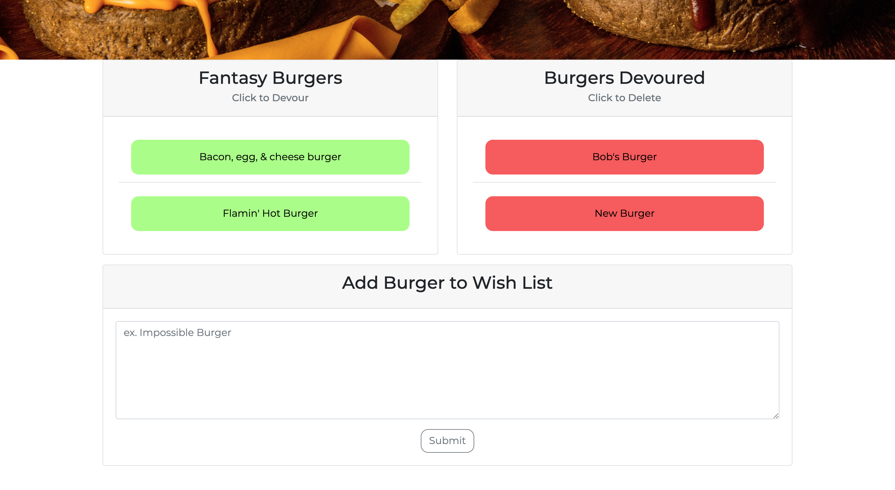

# Fantasy Burger Wish List

Fantasy Burger Wish List is a full stack application that allows users to add their dream burgers they have been itching to try. Users can add any dream burger to the gotta have it list, once they get a chance to eat their burger, they have the ability to label it devoured. Once devoured the burger moves from their gotta have it list to the devoured list on the screen. Sometimes the best way to achieve a goal is to write it down!

This application was built using MySQL, Node, Express, Handlebars, JavaScript, and a homemade ORM. The structure of the application follows the model, view, controller design philosophy. Fantasy Burger Wish List is true full-stack application that allows the users to complete the full C.R.U.D. circle for data. 

## Table of Contents
* [Technologies](#technologies)
* [Usage](#usage)
* [Finished Product](#finished-product)
* [Questions](#questions)

## Technologies
* MySQL
* Handlebars
* JavaScript
* Node.js
* Express.js
* Heroku
* HTML
* CSS
* Bootstrap

## Usage
* Navigate to the [deployed Heroku App](https://ng-burger-eater.herokuapp.com/).
* Click 'View Menu' button to view burgers currently on the menu.
* Click the 'Add to Wish List' button to add any burger you'd like to the wish list.
* Devour a burger by clicking on it, burger is then added to devoured list.
* Once a burger has been devoured, you may click on it to delete it.

## Finished Product
View deployed Heroku app [here](https://ng-burger-eater.herokuapp.com/).

## Questions
​
If you have any questions about the repo, please contact me:

On GitHub: [ngoudeau2012](https://github.com/ngoudeau2012) | Via Email: ngoudeau2012@gmail.com